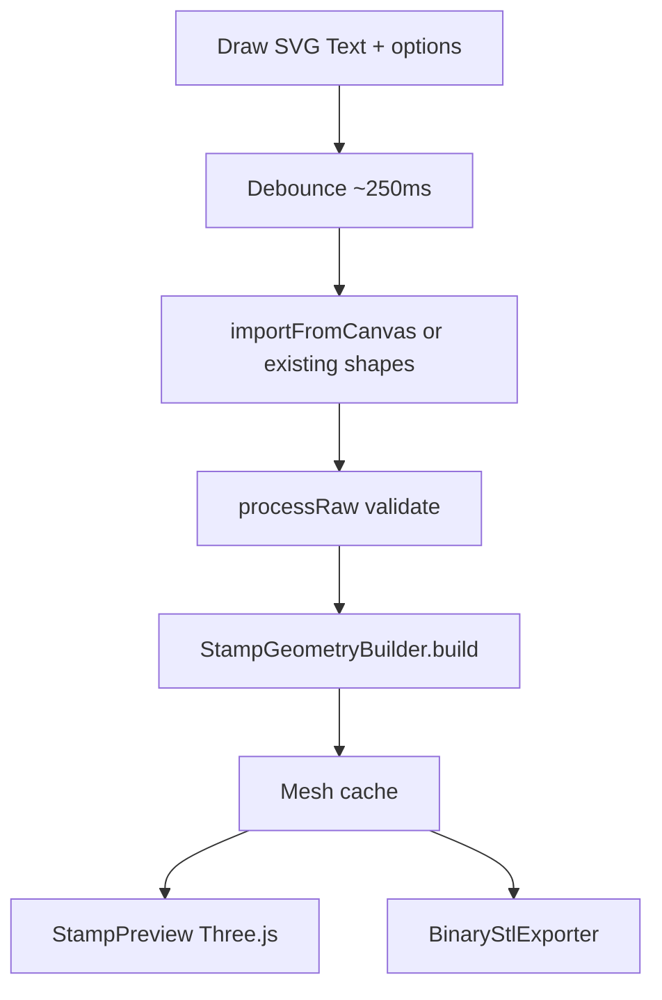

# Layout + live full-stamp 3D preview

## Decisions (locked)

- **Layout:** Brand header 100% top (no left nav) → Design | Preview 50/50 → Export footer 100%
- **Preview fidelity:** Full assembly (design + base + handle) — same `StampGeometryBuilder.build()` mesh as download
- **Rebuild cadence:** Debounced live (~250ms) on canvas/options changes; also after SVG/text import reaches `ready`
- **Renderer:** Plain `three` in web-app only (no R3F); geometry-core stays render-free
- **No Web Worker** in this pass; if unions hitch the UI, worker is a follow-up

## Target layout

```
┌──────────────────────────────────────────────┐
│ Brand header (100%)                          │
├─────────────────────┬────────────────────────┤
│ 01. Design (50%)    │ 02. Preview (50%)      │
├─────────────────────┴────────────────────────┤
│ 03. Export footer (100%)                     │
└──────────────────────────────────────────────┘
```

Mobile (`< lg`): stack Design → Preview → Export; header stays on top.

## Architecture



**Key rule:** Build once, consume twice. Preview and download share the same `Mesh`. Never parse Binary STL for preview.

## 1. Shell / layout

Rewrite composition in [`packages/web-app/src/App.tsx`](packages/web-app/src/App.tsx):

- Remove `lg:ml-[min(40%,28rem)]` and `max-w-2xl`
- Structure:
  - `BrandHeader` (top)
  - `main`: `lg:grid lg:grid-cols-2` for Design | Preview; stack below `lg`
  - Export as full-width footer section (not a fixed `position:fixed` bar unless height requires it — prefer in-flow footer spanning the content width)

Replace [`packages/web-app/src/components/Sidebar.tsx`](packages/web-app/src/components/Sidebar.tsx) with **`BrandHeader`**:

- Keep product title, tagline, privacy line
- Drop numbered section nav (`01. Design` / `02. Export` links)
- Horizontal, full-width; smaller title than current hero sidebar (`text-3xl` / `sm:text-4xl` range)

Move ValidationMessages into the Design column (under inputs) and/or surface a short status near Preview when invalid/empty.

## 2. Pipeline: mesh build + debounce hooks

Extend [`packages/web-app/src/hooks/useStampPipeline.ts`](packages/web-app/src/hooks/useStampPipeline.ts):

- Split export into:
  - `buildMesh(options, shapesOverride?) → Promise<Mesh | null>` (hardware load + `StampGeometryBuilder.build`)
  - `exportStl(...)` → `buildMesh` then `BinaryStlExporter.export` (or reuse cached mesh when still valid)
- Expose preview state, e.g.:
  - `previewMesh: Mesh | null`
  - `previewStatus: "idle" | "building" | "ready" | "error"`
- Add `rebuildPreview(options, shapesOverride?)` that sets building → mesh/error
- Keep DIP: web-app only talks to geometry-core public APIs

New small hook [`packages/web-app/src/hooks/useDebouncedStampPreview.ts`](packages/web-app/src/hooks/useDebouncedStampPreview.ts) (or logic in App):

- **Draw mode:** on Fabric object changes + options changes → debounce 250ms → `importFromCanvas` → on `ready` → `buildMesh` → set `previewMesh`
- **SVG/Text:** after successful import (`ready`) and on options change → debounce → `buildMesh` from cached shapes
- Skip build when idle/invalid/empty canvas
- Cancel/ignore stale async results (generation counter)

Wire DrawingCanvas change notifications (Fabric `object:added|modified|removed` / path created) via a new optional `onSceneChange` callback on [`DrawingCanvas`](packages/web-app/src/components/DrawingCanvas.tsx) — do not poll.

## 3. StampPreview component

Add [`packages/web-app/src/components/StampPreview.tsx`](packages/web-app/src/components/StampPreview.tsx) + thin mesh adapter:

- Dependency: add `three` (+ `@types/three` if needed) to web-app `package.json` only
- Adapter [`mesh-to-three-geometry.ts`](packages/web-app/src/lib/mesh-to-three-geometry.ts): `Mesh` → `BufferGeometry` (`position` + `index`, then `computeVertexNormals()`)
- Viewer responsibilities:
  - WebGL canvas filling the Preview column (aspect-contained, navy-dark clear color)
  - OrbitControls (from `three/examples/jsm/controls/OrbitControls.js`)
  - Center/fit camera to mesh bounds on each new mesh
  - Dispose geometry/materials/renderer on unmount and on mesh replace
  - Empty / building / invalid placeholders (no fake mesh)
- Keep component presentational: props `{ mesh, status }` — no pipeline imports inside the viewer

## 4. Design column / canvas fit

- Keep Design content (tabs + draw/svg/text) in left column
- Make the 400px Fabric square fit the column: constrain with `max-w-full` wrapper; if column &lt; 400px, scale via CSS transform or reduce canvas display size while keeping logical `DRAWING_CANVAS_SIZE_PX` for geometry (prefer CSS scale of the existing 400px canvas over changing units mid-flight)

## 5. Export footer

- Full-width section under the split: status + copy + `DownloadButton`
- Prefer download from latest `previewMesh` when present and options/shapes unchanged; otherwise `buildMesh` then export (avoids double work after a live preview)

## 6. Tests

- Update [`packages/web-app/test/App.test.tsx`](packages/web-app/test/App.test.tsx): brand heading still present; no reliance on sidebar nav
- Unit-test `mesh-to-three-geometry` (vertices/index mapping) with a tiny fixture Mesh — mock or avoid WebGL in jsdom
- Pipeline: `buildMesh` returns mesh; `exportStl` still produces bytes (extend existing pipeline tests if present)
- StampPreview: smoke test with mocked `three` or “renders placeholder when no mesh” without requiring WebGL

## Out of scope

- Web Worker for Manifold unions
- R3F / drei
- Changing geometry-core Mesh format or adding normals there
- Sticky/fixed export chrome (unless layout QA shows it necessary)

## Implementation order

1. BrandHeader + App shell grid (layout only, Preview placeholder)
2. `buildMesh` + mesh cache in pipeline; wire Export to reuse mesh
3. `mesh-to-three-geometry` + StampPreview with OrbitControls
4. Debounced live rebuild from DrawingCanvas events + options/import
5. Tests + polish empty/building/invalid states
