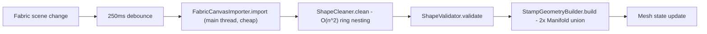
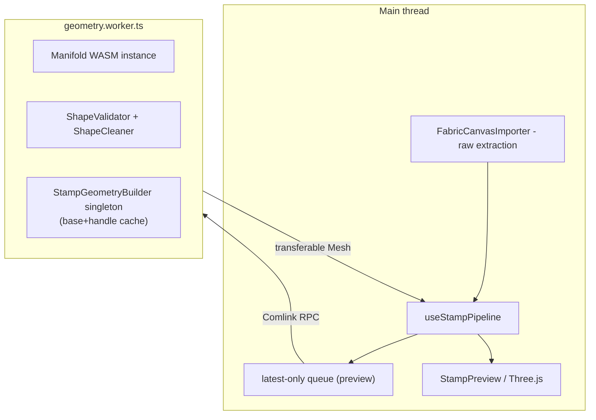

# Preview Pipeline Web Worker + Fewer Unions

## Root cause

Every debounced preview rebuild (`PREVIEW_DEBOUNCE_MS = 250` in [`useDebouncedStampPreview.ts`](packages/web-app/src/hooks/useDebouncedStampPreview.ts)) runs entirely synchronously on the main thread:

- [`useStampPipeline.ts`](packages/web-app/src/hooks/useStampPipeline.ts) `rebuildPreview`/`buildMesh` call `new StampGeometryBuilder().build(...)` directly — a synchronous, blocking call.
- [`stamp-geometry-builder.ts`](packages/geometry-core/src/geometry/stamp-geometry-builder.ts) does `unionMeshes(unionMeshes(design, base), handle)` — **two** native Manifold CSG unions per rebuild, every time, even though `handle` (and often `base`) don't change between edits.
- [`shape-cleaner.ts`](packages/geometry-core/src/validate/shape-cleaner.ts) `orientRingsForFill` is O(n²) (`ringFullyInside` full point-in-polygon test between every ring pair) — costly when text/border designs produce many glyph contours (`maxRingCount: 2000` in `useStampPipeline.ts`).
- This was a known gap: the original layout plan explicitly noted *"No Web Worker in this pass; if unions hitch the UI, worker is a follow-up"* — this is that follow-up.

## 1. Move the heavy pipeline into a Web Worker (Comlink)

- Add `comlink` to [`packages/web-app/package.json`](packages/web-app/package.json) dependencies.
- New `packages/web-app/src/lib/geometry-pipeline-core.ts`: pure functions wrapping `ensureManifoldReady`, `ensureStampHardwareLoaded`/fonts, `ShapeValidator`, `ShapeCleaner`, a **singleton** `StampGeometryBuilder`, `SvgFileImporter`, `TextOutlineImporter` — the same logic `processRaw`/`buildMesh` use today, just relocated. `FabricCanvasImporter` stays out (needs a live DOM canvas) — raw extraction from Fabric stays on the main thread (it's cheap, just point reads).
- New `packages/web-app/src/workers/geometry.worker.ts`: thin adapter, `Comlink.expose(pipelineApi)` around `geometry-pipeline-core.ts`. Runs its own Manifold WASM instance, its own hardware/font fetch (worker has `fetch`, no DOM needed).
- New `packages/web-app/src/lib/geometry-client.ts`: `GeometryClient` interface (`processCanvas`, `processSvg`, `processText`, each returning shapes/issues + built `Mesh`) with two implementations:
  - `createWorkerGeometryClient()` — real `new Worker(new URL("../workers/geometry.worker.ts", import.meta.url), { type: "module" })` + `Comlink.wrap`. Used by the app by default.
  - `createInProcessGeometryClient()` — calls `geometry-pipeline-core.ts` directly (no thread hop). Used by tests, so `useStampPipeline` tests keep working without needing a real `Worker` in jsdom.
- `useStampPipeline(client: GeometryClient = createWorkerGeometryClient())` takes the client via DI; existing tests ([`useStampPipeline.test.ts`](packages/web-app/test/hooks/useStampPipeline.test.ts), [`useStampPipeline.preview.test.ts`](packages/web-app/test/hooks/useStampPipeline.preview.test.ts)) pass `createInProcessGeometryClient()` explicitly. State machine (`idle → importing → validating → ready/invalid`) is preserved: `importing` = main-thread raw extraction, `validating` = the in-flight worker RPC (clean+validate+build combined into one round trip).
- Mesh transfer: `Mesh { vertices: Float32Array; triangleIndices: Uint32Array }` ([`types.ts`](packages/geometry-core/src/geometry/types.ts)) is returned via `Comlink.transfer(result, [vertices.buffer, triangleIndices.buffer])` — zero-copy.
- Warm the worker (kick off `initManifold` + hardware/font fetch) on `App` mount instead of waiting for the first debounce, so first-draw latency isn't worse than today.

### Queueing semantics (important nuance)

- **Live preview** (`rebuildPreview`, driven by the 250ms debounce): wrap calls in a small `createLatestOnlyQueue` helper (new `packages/web-app/src/lib/latest-only-queue.ts`, unit-testable in isolation) — if a newer scene/options change arrives while a build is in flight, only the latest request is kept; superseded ones are dropped without even reaching the worker. Replaces/extends the existing `previewGenerationRef` check (today's check only discards *results*; the new queue avoids *starting* redundant worker work too).
- **Explicit actions** (`buildMesh` for Download, `exportStl`) must **not** be coalesced/dropped — a user click always resolves. These go straight to the worker client; the worker's single message queue naturally serializes them after any in-flight preview build (FIFO), which is correct.

## 2. Cut union work: cache the static base+handle assembly

`handle` never depends on `StampOptions`; `base` only changes when `baseShape`/`canvasSizeMm` change — but both currently get re-unioned into the design on *every single edit*.

In [`stamp-geometry-builder.ts`](packages/geometry-core/src/geometry/stamp-geometry-builder.ts):
- Reorder to `unionMeshes(positionedDesign, baseHandleAssembly)` (union is associative/commutative — same result).
- Give `StampGeometryBuilder` an internal cache: `{ key: \`${baseShape}:${canvasSizeMm}\`, mesh }`, recomputed only when that key changes; otherwise reuse the cached `union(base, handle)`.
- **Requires callers to reuse one `StampGeometryBuilder` instance** instead of `new StampGeometryBuilder()` per call — the worker's module-level singleton (from step 1) makes this automatic. Update the existing per-test `new StampGeometryBuilder()` usage only where it's meant to verify caching.
- Net effect: a pure design edit (the common case while drawing) drops from 2 unions to 1; base/handle union only recomputes when canvas size or base shape actually changes.
- New test in [`stamp-geometry-builder.test.ts`](packages/geometry-core/test/geometry/stamp-geometry-builder.test.ts): spy/count on `unionMeshes` (via `vi.mock` partial of `./union`) to assert the base+handle union is **not** recomputed across two `build()` calls with the same `baseShape`/`canvasSizeMm` but different shapes, and **is** recomputed when `canvasSizeMm` changes.

## 3. Cheap win: bbox short-circuit in ShapeCleaner ring nesting

In [`shape-cleaner.ts`](packages/geometry-core/src/validate/shape-cleaner.ts), `orientRingsForFill`'s O(n²) `ringFullyInside` check does a full point-in-polygon test for every ring pair. Precompute each ring's bounding box once and skip the point-in-ring test when two rings' bboxes don't overlap (pure additive optimization, same results, fewer comparisons) — meaningful for text designs that can emit hundreds of glyph contours. Covered by existing + one new regression test in [`shape-cleaner.test.ts`](packages/geometry-core/test/validate/shape-cleaner.test.ts) confirming identical output on nested/disjoint ring fixtures.

*(Deeper algorithmic rework of the nesting check — e.g. spatial indexing — is left as a follow-up if profiling after this change shows it's still a bottleneck; moving it off-thread already stops it from freezing the UI.)*

## Out of scope

- Moving `BinaryStlExporter` into the worker — it's cheap pure serialization; the hook already reuses the cached `Mesh` from the worker for downloads, no need for another round trip.
- A worker pool / multiple workers — one long-lived worker is enough at this scale.
- Rewriting the O(n²) nesting algorithm beyond the bbox short-circuit (measure first).

## Testing (per TDD skill)

Each behavioral change lands as its own Red → Green cycle:
1. `latest-only-queue.test.ts` (new, pure unit, fake timers/fake async fn).
2. `stamp-geometry-builder.test.ts` — base+handle cache reuse/invalidation.
3. `shape-cleaner.test.ts` — bbox short-circuit regression.
4. `useStampPipeline.test.ts` / `useStampPipeline.preview.test.ts` — updated to inject `createInProcessGeometryClient()`; assert existing state-machine/caching behavior still holds.
5. Manual smoke check via `npm run dev` that the real worker boots (Vite module worker + `manifold.wasm?url` resolves inside the worker bundle) and the preview stays responsive while typing/drawing during a build.
