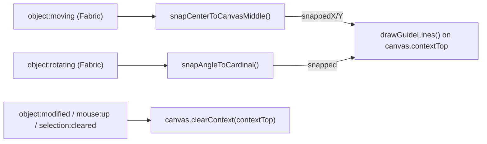

## Scope (confirmed with user)

- **Position snap:** canvas center only — vertical mid-line (`x = 200`), horizontal mid-line (`y = 200`), and their crossing point (canvas center `(200, 200)`). No snapping to canvas edges or to other SVG layers.
- **Rotation snap:** snap angle to cardinal orientations `0°, 90°, 180°, 270°` while dragging the rotate handle, with a guide indicator — mirrors Instagram's "snap back to horizontal" behavior.
- Only Fabric groups tagged `stampSvgId` are draggable/rotatable today ([`DrawingCanvas.tsx`](packages/web-app/src/components/DrawingCanvas.tsx) lines 313-336), so snapping only needs to apply to those.

## Architecture

- New pure-logic module: `packages/web-app/src/lib/snap-guides.ts`
  - `snapCenterToCanvasMiddle(center: Point2DLike, canvasCenter: Point2DLike, tolerancePx: number): { x: number; y: number; snappedX: boolean; snappedY: boolean }`
  - `snapAngleToCardinal(angle: number, toleranceDeg: number): { angle: number; snapped: boolean }` — handles wraparound (e.g. 358° snaps to 360→0°).
  - Constants: `SNAP_TOLERANCE_PX = 8`, `ROTATION_SNAP_TOLERANCE_DEG = 5`, `CARDINAL_ANGLES = [0, 90, 180, 270]`.
  - Same style as existing [`smooth-stroke.ts`](packages/web-app/src/lib/smooth-stroke.ts): typed `Point2DLike`, documented pure functions, fully unit-testable without Fabric.

- Wire into [`DrawingCanvas.tsx`](packages/web-app/src/components/DrawingCanvas.tsx) (near the existing `object:modified`/`mouse:down:before` listeners, lines ~308-336):
  - `canvas.on("object:moving", handleObjectMoving)`: only for `isStampSvgObject(target)`. Compute `target.getCenterPoint()`, call `snapCenterToCanvasMiddle`, and if snapped, reposition via `target.setPositionByOrigin(new Point(x, y), 'center', 'center')` + `target.setCoords()`. Draw guide line(s) for whichever axis snapped.
  - `canvas.on("object:rotating", handleObjectRotating)`: only for `isStampSvgObject(target)`. Call `snapAngleToCardinal(target.angle, ...)`, mutate `target.angle` directly when snapped (standard Fabric snap-angle pattern), and draw a horizontal/vertical guide through the object's center as feedback.
  - Guide rendering uses `canvas.contextTop` (Fabric's transient overlay canvas — confirmed present in `fabric@7.4.0`, along with `clearContext`/`clearContextTop`) so guide lines never become canvas objects: they're excluded from `getObjects()`/export, the undo/redo stack, and `object:modified` — zero risk to existing stroke/SVG export logic.
  - Clear guides (`canvas.clearContext(canvas.contextTop)`) on `object:modified`, `mouse:up`, and `selection:cleared` so no stale line persists after the interaction ends.
  - Guide style: 1px dashed line, accent teal `#64ffda` (matches `--color-accent` in [`index.css`](packages/web-app/src/index.css)) — consistent with the app's existing accent color usage.

## TDD sequence (mandatory — read `.cursor/skills/tdd/SKILL.md` first)

1. Baseline: run the `web-app` test suite (`test/lib` + `test/components/DrawingCanvas.test.tsx`) before any edits.
2. Red/Green #1 — `snap-guides.test.ts`: `snapCenterToCanvasMiddle` snaps x and/or y within tolerance of canvas center, leaves points outside tolerance untouched, and snaps both axes together at the crossing point.
3. Red/Green #2 — same file: `snapAngleToCardinal` snaps near 0/90/180/270 (including wraparound near 360→0), leaves e.g. 45° untouched.
4. Red/Green #3 — extend [`DrawingCanvas.test.tsx`](packages/web-app/test/components/DrawingCanvas.test.tsx) (pattern already used at lines 244-297 for drag/rotate): fire `object:moving` on an SVG group whose target center lands within tolerance of `(200, 200)`; assert the group's center ends exactly at `(200, 200)`. Also assert a point far from center is left unsnapped.
5. Red/Green #4 — same file: fire `object:rotating` with `angle` near `3°`; assert it snaps to `0`. Assert `angle = 47°` stays unsnapped.
6. Refactor once green: extract guide-draw/clear into a small internal helper; re-run full `DrawingCanvas.test.tsx` + `snap-guides.test.ts` suites.
7. `graphify update .` after implementation.

## Out of scope

- Snapping to canvas edges/margins.
- Snapping to other SVG layers' centers/edges (multi-object alignment guides).
- Snapping rotation to non-cardinal angles (e.g. 45°).
- Any change to freehand strokes/text outlines (still non-selectable, unaffected).
