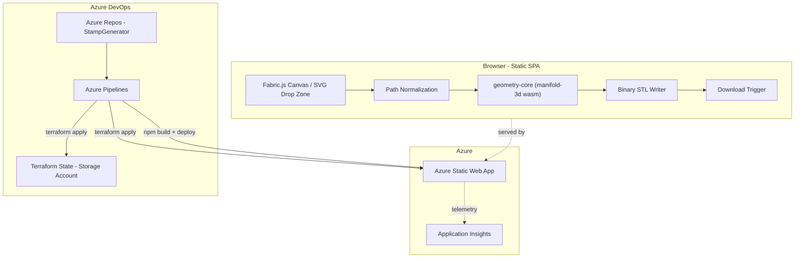

# Stamp Generator - Build Plan

## Confirmed decisions
- Architecture: fully client-side SPA, no backend (Azure Static Web Apps).
- Persistence: stateless - no accounts, no server-side storage.
- v1 geometry scope: true stamp negative (mirrored raised design + base plate, boolean-unioned) - not just a flat extrusion.
- Azure DevOps project already exists: `https://dev.azure.com/mrilczuk/StampGenerator` - plan targets it directly.
- Frontend: React + TypeScript + Vite.
- Development process: strict TDD per `.cursor/skills/tdd/SKILL.md` (Red -> Green -> Refactor, one test at a time, atomic commits).

## Recommended tech stack

- **Language/runtime**: TypeScript everywhere (app, geometry engine, infra scripts).
- **Frontend**: React 18 + Vite + TypeScript.
- **Drawing canvas / SVG import**: Fabric.js - gives interactive freehand drawing AND parses dropped SVGs into flattened path objects (transforms/groups already resolved), so one library covers both input modes.
- **Geometry engine (core)**: [`manifold-3d`](https://github.com/elalish/manifold) (WASM) - handles 2D cross-section cleanup (union, offset, hole detection, simplify), extrusion, mirroring, and robust boolean CSG (union of mirrored design + base plate) in one guaranteed-manifold engine. Runs in both browser and Node (so it's unit-testable headlessly in Vitest without a browser).
- **Curve flattening**: small internal utility (bezier/arc -> polyline at tolerance) or `svg-path-properties`, feeding straight into manifold's `CrossSection`.
- **STL export**: custom lightweight binary STL writer (~50 lines) operating directly on manifold's output mesh (vertex/triangle buffers) - no need to pull in three.js since there's no live 3D preview in v1.
- **State management**: React local state/context only (app is stateless/session-only - no Redux/Zustand needed at this scope).
- **Unit/integration testing**: Vitest (fast, native ESM, integrates with Vite) + `@testing-library/react` for components.
- **E2E testing**: Playwright (drag-drop SVG, draw-and-download flows), run in CI.
- **Linting/formatting**: ESLint + Prettier, enforced in CI and as a pre-commit hook.
- **Package management/monorepo**: npm workspaces (or pnpm) with packages split for testability:
  - `packages/geometry-core` - pure TS + manifold-3d, framework-agnostic (SVG/path parsing, cleanup, extrude, mirror, union, STL export). No DOM dependency -> fastest, most exhaustively TDD'd package.
  - `packages/web-app` - React UI (canvas, drop zone, config panel, download button), consumes `geometry-core`.
- **Infra as code**: Terraform (`azurerm` provider) provisioning Azure Static Web App, Application Insights, resource group, and remote state storage.
- **CI/CD**: Azure Pipelines (YAML), using the existing Azure DevOps project/repo.

## Architecture



## Repository layout

```
StampGenerator/
  packages/
    geometry-core/     # pure TS geometry engine, TDD'd in isolation
    web-app/            # React + Vite UI
  infra/
    bootstrap/          # one-time az-cli script to create TF remote state storage
    terraform/           # azurerm-provider Terraform config (SWA, App Insights, RG)
  azure-pipelines.yml   # CI/CD pipeline (lint -> test -> build -> terraform -> deploy)
  Documentation/
    svg-to-stl-feasibility.md   # existing analysis doc
  .cursor/skills/tdd/...
```

## Stamp negative geometry design (v1 scope)

Since v1 targets a true stamp negative, not a flat extrusion, `geometry-core` needs:
1. Import/normalize -> clean 2D polygons with holes (validated, deduplicated, correctly wound).
2. Mirror the design polygon set horizontally (stamped impression must read correctly).
3. Extrude the mirrored design to `designHeight` (configurable, e.g. 3mm).
4. Generate a base plate rectangle/shape sized to the canvas bounds, extruded to `baseThickness` (configurable).
5. Boolean-union the design solid on top of the base plate via manifold-3d CSG, guaranteeing a single watertight manifold mesh.
6. Apply canvas-to-mm scale factor (e.g. 250mm / canvasUnits) to X/Y before extrusion; heights stay independent real-mm parameters.
7. Serialize the final manifold mesh to binary STL and trigger a download - no live preview.

## Phases (each phase follows the TDD skill: one failing test -> minimal code -> refactor -> atomic commit)

1. **Phase 0 - Foundations & Infra**
   - Scaffold npm workspaces monorepo (`geometry-core`, `web-app`), TS/ESLint/Prettier/Vitest config.
   - `infra/bootstrap`: az-cli script to create the Terraform remote-state storage account/container (one-time, documented, not itself Terraform-managed - avoids chicken/egg).
   - `infra/terraform`: Resource Group, Azure Static Web App, Application Insights, wired to remote state backend.
   - `azure-pipelines.yml`: stages for lint, unit test, build, `terraform plan/apply`, SWA deploy (using the `AzureStaticWebApp@0` pipeline task with PR preview environments).
   - Verify: pipeline runs green on an empty scaffold; `terraform apply` provisions a reachable empty Static Web App.

2. **Phase 1 - Path ingestion & normalization** (`geometry-core`)
   - Parse dropped SVG files and Fabric.js canvas output into a common `PathShape[]` model (points, holes, winding).
   - Flatten transforms, bezier/arc curves into polylines at configurable tolerance.
   - TDD unit tests per parser branch (clean SVG, transformed/grouped SVG, freehand stroke).

3. **Phase 2 - Cleanup & validation** (`geometry-core`)
   - Winding-order correction, hole detection, self-intersection resolution/union via manifold `CrossSection`.
   - Minimum-feature-size validation and rejection/auto-fix rules; degenerate/zero-area filtering.
   - TDD unit tests using intentionally messy fixture SVGs (self-intersecting, disjoint fragments, nested holes).

4. **Phase 3 - Stamp-negative 3D generation** (`geometry-core`)
   - Mirror + extrude design; generate + extrude base plate; boolean union via manifold-3d.
   - Configurable `designHeight`, `baseThickness`, canvas-to-mm scale factor.
   - TDD tests assert output mesh is manifold/watertight (via manifold-3d's own validity checks) and has expected bounding box/volume for known input shapes.

5. **Phase 4 - STL export**
   - Binary STL writer from manifold mesh buffers; download trigger wiring.
   - TDD tests parse the generated STL bytes back and assert triangle count, header, and bounding box match the source mesh.

6. **Phase 5 - Web app UI** (`web-app`)
   - Fabric.js drawing canvas + SVG drop zone, config panel (extrude height, base thickness, canvas size/mm mapping), validation error messaging, download button.
   - Component tests (RTL) written first for each interactive piece per TDD; wire to `geometry-core`.

7. **Phase 6 - E2E hardening**
   - Playwright flows: draw a letter and download STL; drop a messy SVG and see validation feedback; drop a clean SVG and download STL.
   - Cross-check a handful of adversarial fixture SVGs end-to-end.

8. **Phase 7 - Deployment hardening**
   - Finalize Terraform (custom domain if desired, App Insights alerts), pipeline branch policies (PR builds + preview SWA environments, required checks before merge to main), production release gate.

## Testing strategy (maps to TDD skill)

- `geometry-core` is pure TS + WASM, no DOM -> ideal for strict, exhaustive Red-Green-Refactor unit testing in Vitest (majority of test volume lives here).
- `web-app` components get TDD'd with RTL for logic-bearing behavior (validation messages, config state, download trigger wiring); purely presentational markup is lower priority for strict TDD.
- Playwright e2e covers a small number of critical user journeys only, added after the underlying units are green (not itself written test-first at the unit granularity the skill mandates).
- Each phase's baseline tests are run first (Phase 1 of the TDD skill) before any new code in that phase, per the skill's "Contextual Impact Mapping" step.

## Open items to confirm before Phase 0 starts

- Azure subscription to target (subscription ID/tenant) for Terraform's `azurerm` provider and Azure DevOps service connection.
- Whether a custom domain is desired for the Static Web App now or later.
- Confirm npm vs pnpm workspaces preference (default recommendation: npm workspaces for simplicity, no extra tooling).
