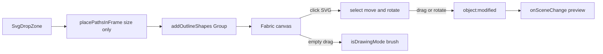

# SVG drag-to-reposition on canvas

## Decisions (locked)

- **Interaction:** Auto hit-test — pointer on an SVG selects it for move/rotate; empty canvas keeps freehand draw.
- **UI:** Remove Position X/Y inputs and Reposition button. Keep **Size (% of stamp)** for initial import scale only (centered at 0,0).
- **Chrome:** Single-select only. Subtle selection border; **rotation handle enabled**; scale/resize locked off. Move cursor on hover/body-drag.
- **Hint copy:** Short note that SVGs can be repositioned by clicking and dragging on the canvas, and rotated via the selection handle.
- **Source of truth after drop:** Fabric object transform (including `angle`). Live preview already reads canvas-space points via `calcTransformMatrix` in [`DrawingCanvas.tsx`](packages/web-app/src/components/DrawingCanvas.tsx), so move/rotate updates export without re-running `placePathsInFrame`.

## Current blockers

| Issue | Where |
|-------|--------|
| Polygons non-interactive | [`outline-to-fabric.ts`](packages/web-app/src/lib/outline-to-fabric.ts) `selectable: false`, `evented: false` |
| Drawing mode always on | [`DrawingCanvas.tsx`](packages/web-app/src/components/DrawingCanvas.tsx) `isDrawingMode: true` |
| Position-by-value UI | [`SvgInputPanel.tsx`](packages/web-app/src/components/SvgInputPanel.tsx) X%/Y% + Reposition |
| Re-import reposition | [`App.tsx`](packages/web-app/src/App.tsx) `handleSvgReposition` |

## Implementation approach

### 1. Make SVG imports selectable as one unit

In `addOutlineShapes` (or a small helper next to `outline-to-fabric`):

- Build polygons as today, tag with `stampSvgId`.
- Wrap them in a Fabric `Group` so multi-ring SVGs (ink + holes) move and rotate together.
- Group props: `selectable: true`, `evented: true`, `hasBorders: true`, `hasControls: true`, `lockScalingX/Y: true`, `lockRotation: false`, `hoverCursor: "move"`, `moveCursor: "move"`.
- Hide scale corner/edge controls via Fabric `setControlsVisibility` (or equivalent); keep only the **rotation** control visible for a subtle chrome.
- Keep freehand paths and text outlines non-selectable (`selectable`/`evented` false) so only SVG uploads are interactive.
- `removeBySvgId` must remove the group (or all members) by `stampSvgId`.

### 2. Auto draw vs select in DrawingCanvas

While `isDrawingMode` is true, Fabric ignores object selection. Implement pointer gate:

- On `mouse:down`: hit-test target; if it is an SVG group (`stampSvgId`) or its rotate control, temporarily `isDrawingMode = false`, set active object, allow move/rotate.
- On `selection:cleared` / click empty / after interaction ends: restore `isDrawingMode = true`.
- On `object:modified` for SVG groups: keep existing `notifySceneChange()` (already wired) so rotation angle is baked into exported points.
- Sync panel layer selection when canvas selects an SVG (`onSvgSelect?.(svgId)` optional callback) so the layer list highlights the same item; clicking a layer in the list can `setActiveObject` on that group (nice consistency, include if cheap).

### 3. Strip numeric reposition UI

[`SvgInputPanel.tsx`](packages/web-app/src/components/SvgInputPanel.tsx):

- Remove X/Y state, inputs, Reposition button, `onReposition` prop.
- Import placement: `offsetXFraction: 0`, `offsetYFraction: 0`, size from Size %.
- Add muted helper text under Size or above the drop zone, e.g. *Click and drag an SVG on the canvas to reposition it; use the handle to rotate.*

Wire through [`CollapsibleSvgPanel.tsx`](packages/web-app/src/components/CollapsibleSvgPanel.tsx) and [`App.tsx`](packages/web-app/src/App.tsx): delete `handleSvgReposition` and `onReposition`. Keep `placement` on `SvgLayer` for size/frame metadata only (offsets stay 0).

### 4. TDD sequence (mandatory)

Follow [`.cursor/skills/tdd/SKILL.md`](.cursor/skills/tdd/SKILL.md): baseline → one failing test → minimal green → refactor → next test. Never test+impl in the same turn.

Suggested red order:

1. **SVG groups selectable/evented** with borders, rotation unlocked, scaling locked — extend [`outline-to-fabric` tests](packages/web-app/test/lib/outline-to-fabric.test.tsx) and/or [`DrawingCanvas.test.tsx`](packages/web-app/test/components/DrawingCanvas.test.tsx) via `__drawingCanvasTestHooks`.
2. **Drag moves object in canvas space** — set `left`/`top`, assert points shifted; `onSceneChange` fired.
3. **Rotate updates canvas-space points** — set `angle`, assert exported polygon points reflect rotation; `onSceneChange` fired.
4. **Multi-polygon SVG moves/rotates as one** — two rings same `svgId` share one group transform.
5. **Panel UI** — X/Y/Reposition gone; helper note present; drop still passes centered placement with size — update [`CollapsibleSvgPanel.test.tsx`](packages/web-app/test/components/CollapsibleSvgPanel.test.tsx).
6. **Hit-test gate** (if testable without brittle DOM): mouse-down on SVG disables drawing mode / selects object; empty down keeps drawing mode.

### 5. Graphify

After code changes: `graphify update .`

## Out of scope

- Multi-select / marquee groups of different SVGs
- Resize / scale handles (size remains Size % at import)
- Changing initial placement away from center (still size-scaled, centered)
- Replacing Size % with canvas pinch/scale
