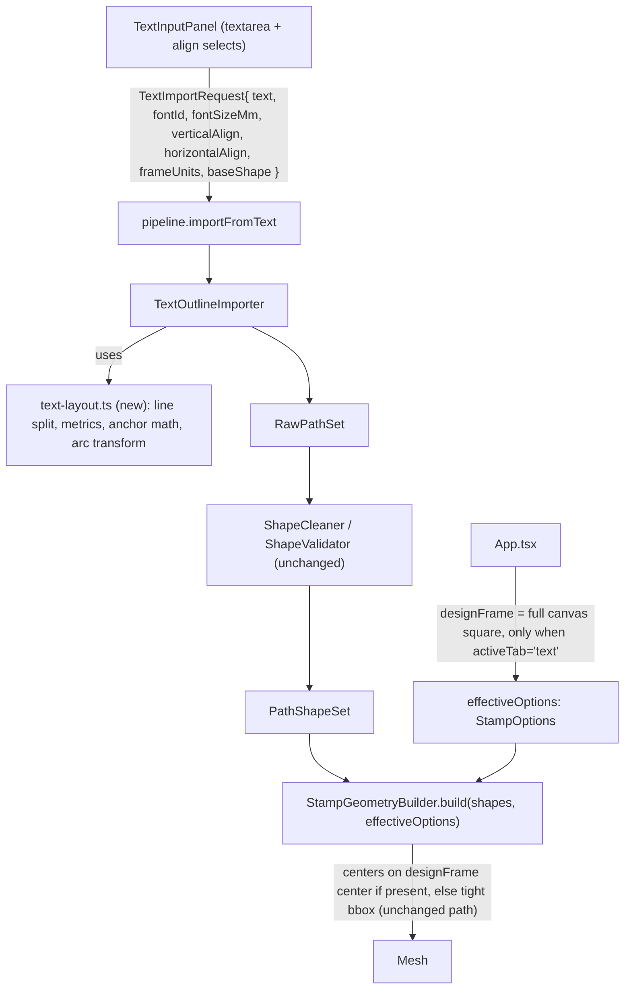

# Text alignment modes

## Behavior being built (per your answers)

- **Vertical align** (single select, mutually exclusive): `center` (default, current behavior) | `top` | `bottom` | `top-down` | `border`.
  - `top-down`: stacks the letters of one logical line vertically (reads top-to-bottom), centered as a column on the stamp. Multi-line input is flattened (newlines ignored) for this mode.
  - `border`: only offered when `baseShape === "round"` (hidden for square). Line 1 arcs along the top of the circle reading left-to-right; line 2 (if present) arcs along the bottom, rotated so it still reads upright (classic seal-stamp look). Lines 3+ are ignored for v1.
- **Line align** (new, for multi-line `center`/`top`/`bottom`): `left` | `center` (default) | `right` - governs how shorter lines sit relative to the widest line within the text block; the block itself is still horizontally centered on the stamp.
- Text input becomes a `<textarea>` so users can type multiple lines.

## Why this needs a builder change, not just importer changes

[packages/geometry-core/src/geometry/stamp-geometry-builder.ts](packages/geometry-core/src/geometry/stamp-geometry-builder.ts) always re-centers the design by the design's own tight mesh bounding box onto the base's bounding box (lines 39-43). If the importer positions text near the top of its canvas, this auto-centering step will immediately undo it by re-centering the tight glyph bbox back to the middle. `center` alignment "works" today only because tight-bbox-center happens to equal what we want.

**Fix:** add an optional `designFrame` (canvas-unit bbox) to `StampOptions`. When present, the builder centers using the *frame's* center instead of the tight mesh bbox center (X/Y only - Z centering is unaffected and stays tight-bbox-based). Draw/SVG flows never set it, so their behavior is unchanged (verified against existing `stamp-geometry-builder.test.ts` which doesn't set it). The Text flow always sets it to the full drawing-canvas frame (same `canvasSizeUnits` square already used by `DrawingCanvas`/`scaleToMm`), so "top" lands near the top of the round/square base, "border" text follows the actual base's circle, etc.



## Changes by file

### `packages/geometry-core/src/import/types.ts`
Extend `TextImportRequest`:
```ts
export type TextVerticalAlign = "center" | "top" | "bottom" | "top-down" | "border";
export type TextLineAlign = "left" | "center" | "right";

export interface TextImportRequest {
  text: string;               // may contain \n for multiple lines
  fontId: BundledFontId;
  fontSizeMm: number;
  verticalAlign?: TextVerticalAlign;   // default "center"
  lineAlign?: TextLineAlign;           // default "center"
  frameUnits: number;                  // canvas-unit square the text lays out within (e.g. 400, matches canvasSizeUnits)
  baseShape: "square" | "round";       // needed for border-mode radius; importer no-ops border on square
}
```

### `packages/geometry-core/src/import/text-layout.ts` (new)
Pure, unit-testable layout helpers used by the importer:
- Split `text` into lines (`\n`), compute per-line advance widths using font metrics (kerning-aware, reusing the existing per-char advance loop).
- `center`/`top`/`bottom`: compute block width/height from font ascender/descender metrics (not just glyph tight bbox, so lines without descenders don't sit inconsistently), anchor the block within the `frameUnits` square with a margin, and per line apply `lineAlign` (left/center/right against the block's max line width).
- `top-down`: flatten input to one string (drop `\n`), treat each character as its own row, stack with a fixed vertical pitch derived from font metrics, center the column on the frame.
- `border`: guarded on `baseShape === "round"`. For up to 2 lines: compute each line's total arc length (sum of glyph advances), pick a radius inset from `frameUnits/2`, derive angular sweep = arcLength/radius, and return a per-glyph placement (rotation angle + arc position) so the caller can rotate+translate each glyph's local outline. Bottom line's glyphs get an extra 180° rotation and reversed placement order so text reads upright, not mirrored/upside-down.
- Exposes a small point-rotation/translation helper for applying a glyph's local outline to an arc position.

### `packages/geometry-core/src/import/text-outline-importer.ts`
Restructure the per-character loop:
1. Build glyph outlines in **local space** per character (as now, via `commandsToRings`), but keep each glyph's local rings + advance width separate instead of writing directly into global `x`-advanced coordinates.
2. Call into `text-layout.ts` to get, per glyph, a target transform: either a simple `(dx, dy)` translate (center/top/bottom/top-down) or a `(rotate, dx, dy)` transform (border).
3. Apply the transform to each glyph's local ring points and push into the final `RawPathSet`.
4. Existing single-line default behavior (no `verticalAlign` specified) must stay byte-for-byte compatible with current output so `text-outline-importer.test.ts` doesn't need semantic changes (only additive tests for new modes).

### `packages/geometry-core/src/geometry/types.ts`
```ts
export interface StampOptions {
  designHeightMm: number;
  canvasSizeUnits: number;
  canvasSizeMm: number;
  baseShape: StampBaseShape;
  /** Canvas-unit bbox to center the design against, instead of the design's
   *  own tight geometry bbox. Set by Text mode so top/bottom/border layout
   *  survives builder placement; Draw/SVG leave this unset (unchanged behavior). */
  designFrame?: { minX: number; maxX: number; minY: number; maxY: number };
}
```

### `packages/geometry-core/src/geometry/stamp-geometry-builder.ts`
Replace the tight-bbox X/Y center computation (lines 39-43) with: if `opts.designFrame` is set, scale its center by the same `canvasSizeMm/canvasSizeUnits` factor used in `scaleToMm` and use that as the design's X/Y center; otherwise keep today's `getMeshBoundingBox(design)`-based center exactly as-is. Z-centering (`dz`) stays tight-bbox-based either way.

### `packages/web-app/src/components/TextInputPanel.tsx`
- Add props: `baseShape: StampBaseShape`, `frameUnits: number` (passed from `App.tsx`, mirroring how `DrawingCanvas` already receives `baseShape`/`canvasSizeMm`).
- Replace the single-line `<input>` for text with a `<textarea>`.
- Add a "Vertical alignment" `<select>`: Center / Top / Bottom / Top-down / Around border - the "Around border" option is omitted/disabled when `baseShape !== "round"`.
- Add a "Line alignment" `<select>`: Left / Center / Right.
- Submit builds `{ text, fontId, fontSizeMm, verticalAlign, lineAlign, frameUnits, baseShape }`.

### `packages/web-app/src/App.tsx`
- Pass `baseShape={options.baseShape}` and `frameUnits={options.canvasSizeUnits}` into `<TextInputPanel>`.
- Compute `effectiveOptions` for the text tab: when `activeTab === "text"`, merge `designFrame: { minX: 0, maxX: options.canvasSizeUnits, minY: 0, maxY: options.canvasSizeUnits }` into `options`; otherwise pass `options` unchanged. Use `effectiveOptions` for `useDebouncedStampPreview` and for `pipeline.exportStl(...)` in `handleDownload`'s non-draw branch.

### Tests
- `packages/geometry-core/test/import/text-layout.test.ts` (new): line splitting/metrics, top/bottom/center anchor math, top-down stacking, border angular-sweep math (e.g. assert glyph anchor points land at expected radius/angle), border disabled on square.
- `packages/geometry-core/test/import/text-outline-importer.test.ts`: extend with cases for each `verticalAlign`, confirming default (no `verticalAlign`) output is unchanged, and that `border` on `baseShape: "square"` behaves like `center` (no-op guard) rather than throwing.
- `packages/geometry-core/test/geometry/stamp-geometry-builder.test.ts`: add a case with `designFrame` set, asserting the design centers on the frame's center rather than its tight bbox; keep existing no-`designFrame` cases passing unchanged.
- `packages/web-app/test/components/TextInputPanel.test.tsx`: update submit-payload assertions for the new fields/defaults; add a case that "Around border" is hidden/disabled when `baseShape="square"`.

## Known v1 limitations (called out, not blockers)
- "Border" only uses up to 2 lines (top arc + bottom arc); a 3rd+ line is dropped.
- "Top" / "Bottom" don't do circular fitting for round stamps - wide text near the top of a round stamp can visually approach the curved edge; margin is a fixed inset, not shape-aware.
- Text tab still doesn't expose the stamp-size/shape selector (unchanged from today) - alignment respects whatever `baseShape`/`canvasSizeMm` is currently set via the Draw tab's selector.
