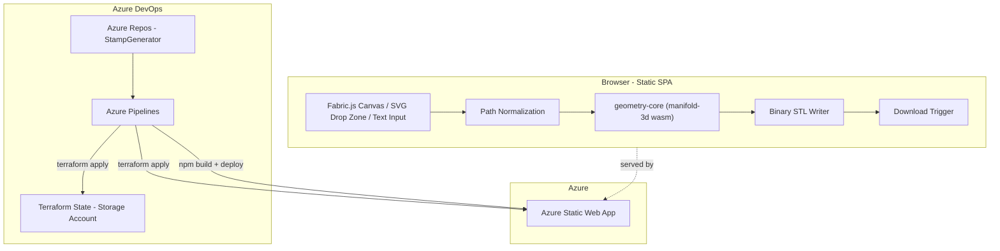

# Stamp Generator - Documentation Index

## Project overview

A fully client-side (no backend, no accounts, no persistence) web app that
lets a user create a real, physical rubber-stamp design and download it as a
3D-printable STL file. Input can be a freehand drawing on a canvas, a dropped
SVG file, or typed text rendered with a bundled font. The app validates and
cleans up the input geometry, generates a true stamp-negative 3D model
(mirrored raised design fused to a base plate), and triggers a direct
download - there is no live 3D preview in v1.

This documentation set is organized as one file per delivery phase, plus this
index. Each phase document is a full spec: goals, module/interface contracts,
file layout, an explicit TDD test-case checklist (to be executed per
`.cursor/skills/tdd/SKILL.md`), acceptance criteria, risks/edge cases, and
dependencies on other phases.

See also: [svg-to-stl-feasibility.md](svg-to-stl-feasibility.md) for the
original technical feasibility analysis that this plan builds on.

## Confirmed project-wide decisions

- **Architecture**: fully client-side SPA, no backend. Hosted on Azure Static
  Web Apps.
- **Persistence**: none - stateless, no user accounts, no server-side storage.
- **v1 geometry scope**: true stamp negative (mirrored raised design + base
  plate, boolean-unioned into a single watertight mesh) - not a flat
  extrusion.
- **v1 input scope**: freehand vector drawing (Fabric.js canvas), dropped SVG
  files, and typed text (font-to-outline via `opentype.js`, using a small set
  of bundled, redistributable fonts - no custom font upload in v1). Raster
  image import (PNG/JPG auto-trace) is explicitly excluded from v1.
- **Frontend**: React + TypeScript + Vite.
- **Geometry engine**: `manifold-3d` (WASM) for 2D cleanup, extrusion,
  mirroring, and robust boolean CSG - runs headlessly in Node for unit tests
  and in the browser for the real app.
- **STL export**: custom lightweight binary STL writer, no `three.js`
  dependency (no live preview needed).
- **Package manager**: npm workspaces monorepo
  (`packages/geometry-core`, `packages/web-app`).
- **Infra as code**: Terraform (`azurerm` provider), targeting Azure Static
  Web Apps + a resource group. No Azure subscription/service connection exists
  yet - this is a manual prerequisite before Phase 0 automation runs (see
  below).
- **CI/CD**: Azure Pipelines (YAML), in the existing Azure DevOps project at
  `https://dev.azure.com/mrilczuk/StampGenerator`.
- **Telemetry**: none in this repository. This app will later be folded into
  a larger ecosystem that already provides telemetry, so no Application
  Insights or browser tracking is added here.
- **Development process**: strict TDD per
  [`.cursor/skills/tdd/SKILL.md`](../.cursor/skills/tdd/SKILL.md) -
  Red -> Green -> Refactor, one test at a time, atomic commits.

## Cross-cutting architecture principles (apply to every phase)

- **SOLID**: every module in `geometry-core` exposes a single-purpose
  interface (one importer per source type, one cleaner, one builder step, one
  exporter). The UI depends on `geometry-core`'s abstractions, never on
  `manifold-3d` internals directly (Dependency Inversion) - via a thin
  `StampPipeline`/`useStampPipeline` facade.
- **KISS**: v1 stamp geometry is composed from small, independently-testable
  pure functions (`mirrorShapes`, `extrudeShapes`, `buildBasePlate`,
  `unionMeshes`) rather than one monolithic "generate" function.
- **DRY**: curve-flattening, scale-mapping, and validation-rule logic are
  written once in `geometry-core` and reused by every importer/consumer
  (canvas, SVG, text); no duplication between import paths.
- **No DOM in `geometry-core`**: keeps it runnable and unit-testable in plain
  Node/Vitest (including `manifold-3d`'s WASM build, which works headlessly).
  `web-app` owns all browser-only concerns (file drop handling, download
  triggering, canvas rendering).

## Repository layout

```
StampGenerator/
  Documentation/
    index.md
    phase-0-foundations.md
    phase-1-ingestion.md
    phase-2-cleanup-validation.md
    phase-3-stamp-geometry.md
    phase-4-stl-export.md
    phase-5-web-app-ui.md
    phase-6-e2e-hardening.md
    phase-7-deployment-hardening.md
    svg-to-stl-feasibility.md
  packages/
    geometry-core/
      src/{model,import,validate,geometry,export}/...
      test/...
    web-app/
      src/{components,hooks,pages}/...
      test/...
  infra/
    bootstrap/            # manual az-cli script + doc for one-time state storage creation
    terraform/             # RG, Static Web App (azurerm provider)
  azure-pipelines.yml
```

## Architecture diagram



## Phase documents

1. [Phase 0 - Foundations & Infrastructure](phase-0-foundations.md)
2. [Phase 1 - Path Ingestion & Normalization](phase-1-ingestion.md)
3. [Phase 2 - Cleanup & Validation](phase-2-cleanup-validation.md)
4. [Phase 3 - Stamp-Negative 3D Geometry Generation](phase-3-stamp-geometry.md)
5. [Phase 4 - STL Export](phase-4-stl-export.md)
6. [Phase 5 - Web App UI](phase-5-web-app-ui.md)
7. [Phase 6 - E2E Hardening](phase-6-e2e-hardening.md)
8. [Phase 7 - Deployment Hardening](phase-7-deployment-hardening.md)

## Manual Azure prerequisite checklist (before Phase 0 automation runs)

- [ ] Identify/create the target Azure subscription and tenant.
- [ ] Create an Azure DevOps service connection (Workload Identity Federation
      preferred over a client secret/certificate) from
      `dev.azure.com/mrilczuk/StampGenerator` to that subscription.
- [ ] Run `infra/bootstrap/create-state-storage.(sh|ps1)` once, manually, to
      create the resource group + storage account + container that will hold
      Terraform remote state (this can't be Terraform-managed itself -
      chicken/egg).

## Open items to confirm before Phase 0 execution begins

- Exact Azure subscription/tenant to target (needed for real Terraform
  variable values and the service-connection setup doc).
- Whether a custom domain is wanted for the Static Web App now (Phase 7) or
  deferred indefinitely.
- Whether mobile/touch support for the drawing canvas is in scope for v1
  `DrawingCanvas` (affects the Phase 5 test matrix), or desktop-only for now.
- Confirm the specific bundled font set (names/licenses) for
  `TextOutlineImporter` in Phase 1, since fonts must be redistributable.

## Glossary

- **`RawPathSet`**: unvalidated 2D path/ring data straight out of an importer
  (Phase 1), before cleanup.
- **`PathShapeSet`**: validated 2D polygons-with-holes (Phase 2), ready for 3D
  geometry generation.
- **Stamp negative**: the actual physical stamp geometry - a mirrored raised
  design fused onto a base plate, as opposed to a plain flat extrusion.
- **Manifold/watertight mesh**: a 3D mesh with no gaps, holes, or
  self-intersections - required for a valid, 3D-printable STL.
