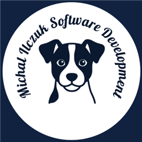
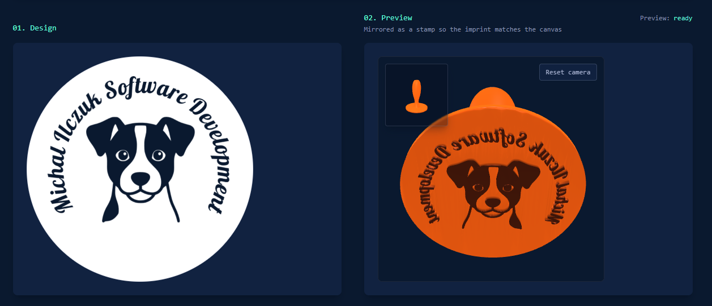
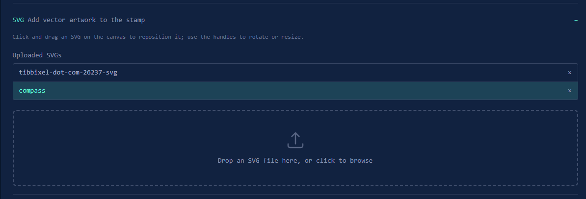
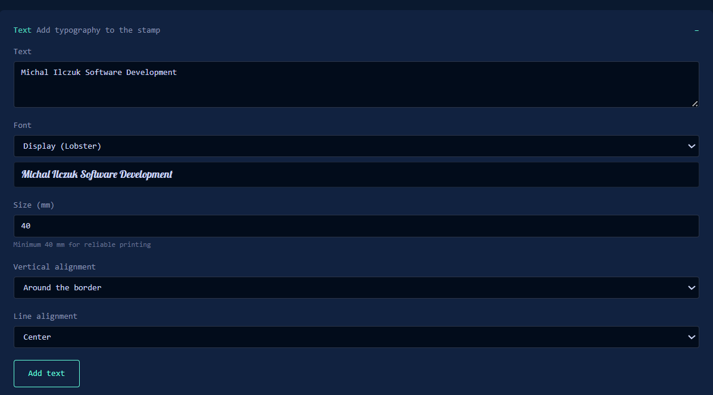

<p align="center">
  
</p>

<h1 align="center">Stamp Generator</h1>

<p align="center">
  Design a rubber stamp, validate the geometry, and download a
  3D-printable STL — entirely in your browser.<br />
  <strong>Client-side only · No accounts · No persistency</strong>
</p>

<p align="center">
  Fully client-side web app that turns drawings, SVG files, or text into a
  3D-printable rubber-stamp STL. Built as an npm workspaces monorepo and deployed
  to Azure Static Web Apps.
</p>

<p align="center">
  
</p>

## What it does

Draw or import artwork on the canvas, preview a mirrored 3D stamp so the imprint
matches your design, then download an STL ready for printing.

<table>
  <tr>
    <td width="50%" valign="top">
      <p align="center"><strong>SVG</strong></p>
      <p align="center">
        
      </p>
      <p>Drop vectors, then drag, rotate, or resize them on the canvas.</p>
    </td>
    <td width="50%" valign="top">
      <p align="center"><strong>Text</strong></p>
      <p align="center">
        
      </p>
      <p>Fonts, size in mm, and border or line layout for typography.</p>
    </td>
  </tr>
</table>

## Packages

- `@stamp-generator/geometry-core` — pure TypeScript geometry pipeline (no DOM)
- `@stamp-generator/web-app` — React + Vite UI

## Prerequisites (uv + graphify)

Agent / Cursor workflows in this repo expect a local
[graphify](https://github.com/graphify-labs/graphify) knowledge graph
(`graphify-out/`). Install both tools before exploring or changing code:

```bash
# 1. uv — installs/runs Python CLIs in isolated envs (needed to install graphify)
#    https://docs.astral.sh/uv/getting-started/installation/
#    Windows (PowerShell):
irm https://astral.sh/uv/install.ps1 | iex
#    macOS / Linux:
curl -LsSf https://astral.sh/uv/install.sh | sh

# 2. graphifyy — PyPI package that provides the `graphify` CLI
#    (maps the repo into graphify-out/ for agent navigation)
uv tool install graphifyy
uv tool update-shell   # if `graphify` is not on PATH, then open a new terminal

# 3a. graphify install — registers the graphify skill with Cursor / other assistants
graphify install
# 3b. graphify update . — builds or refreshes this repo's knowledge graph (AST-only)
graphify update .
```

Use `graphify query` / `path` / `explain` before broad codebase search; after
code edits, run `graphify update .` again (AST-only).

## Local development

To run the app locally you only need install + `dev`. The rest are optional
checks (and useful before a PR).

```bash
# Install dependencies (local / first-time). Prefer this day-to-day.
npm install

# Clean install from package-lock.json only (CI / reproducible builds).
# Use instead of `npm install`, not after it.
npm ci

# Run the web app (Vite dev server)
npm run dev --workspace=@stamp-generator/web-app

# Optional — verify before committing
npm test          # unit tests (workspaces + root Vitest)
npm run lint      # ESLint across packages
npm run build     # production build of all workspaces
```

## Phase 0 infrastructure

Manual Azure prerequisites (subscription, DevOps service connection, and
remote-state storage) are documented in
[Documentation/phase-0-foundations.md](Documentation/phase-0-foundations.md)
and [infra/bootstrap/README.md](infra/bootstrap/README.md).

Run the bootstrap script once before the first Terraform pipeline run:

```powershell
./infra/bootstrap/create-state-storage.ps1
```
